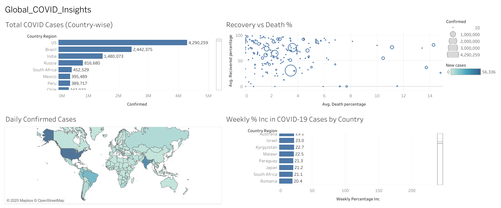

# 🦠 COVID-19 Data Analysis

This project presents a data-driven analysis of global COVID-19 trends using Excel for data cleaning and Tableau for interactive dashboard visualizations.

---

## 🧭 Introduction

The COVID-19 pandemic had a profound global impact, making real-time data analysis essential for understanding its spread, impact, and containment. This project aims to explore worldwide trends using actual data, providing insights into how the virus evolved across countries and over time.

---

## 🎯 Objectives

- Analyze global and country-level COVID-19 trends over time  
- Visualize key metrics such as confirmed cases, deaths, and recoveries  
- Track daily and weekly growth rates to identify surges  
- Compare recovery and mortality rates using interactive dashboards  
- Practice data cleaning with Excel and visualization with Tableau  

---

## 📁 Project Files

- `covid_dataset.csv` – Original dataset used for analysis  
- `covid_dataset_cleaned.xlsx` – Cleaned and processed dataset  
- `covid_analysis_tableau_dashboard.png` – Tableau dashboard screenshot
- `README.md` – Project documentation   

---

## 📊 Dashboard Overview

### 🔍 Insights Extracted:
- Total COVID cases by country  
- Daily confirmed cases globally  
- Weekly percentage increase in COVID-19 cases  
- Recovery % vs Death %

📎 **[View the full interactive dashboard here](https://public.tableau.com/app/profile/diya.patel4361/viz/COVID-19_Analysis_Dashboard/Dashboard1)**  

---

## 📄 Data Source

- Dataset from [Kaggle – Corona Virus Report by imdevskp](https://www.kaggle.com/datasets/imdevskp/corona-virus-report)

---

## ✅ Tools Used

- **Excel** – Data cleaning and preprocessing  
- **Tableau** – Data visualization and dashboard creation  

---

## 📌 Key Learnings

- Analyzed spread, growth, and recovery patterns of COVID-19  
- Gained proficiency in Tableau and Excel-based data workflows  
- Understood real-world data transformation pipelines  
